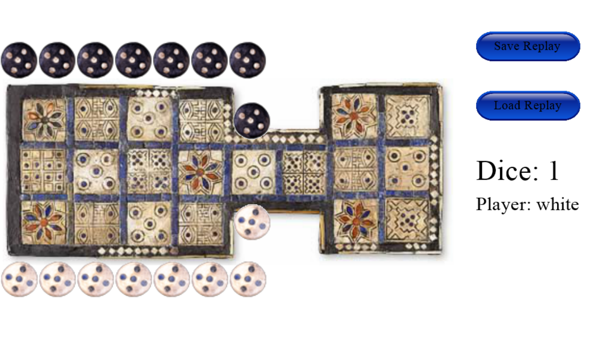

# Game of Ur AI experiment

The first part of this project is about recreating the Game of Ur using the Irving Finkel rule set. https://www.mastersofgames.com/rules/royal-ur-rules.htm

The second part of this project is to use a reinforcement learning AI to solve this game. 
The AlphaGo algorithm was recreated with a smaller model. https://www.nature.com/articles/nature24270.epdf
*This is still an ongoing experiment.*

## How to run the game
```
python3 frontend/frontend.py
```



You can play by simply clicking on the piece you wish to move.